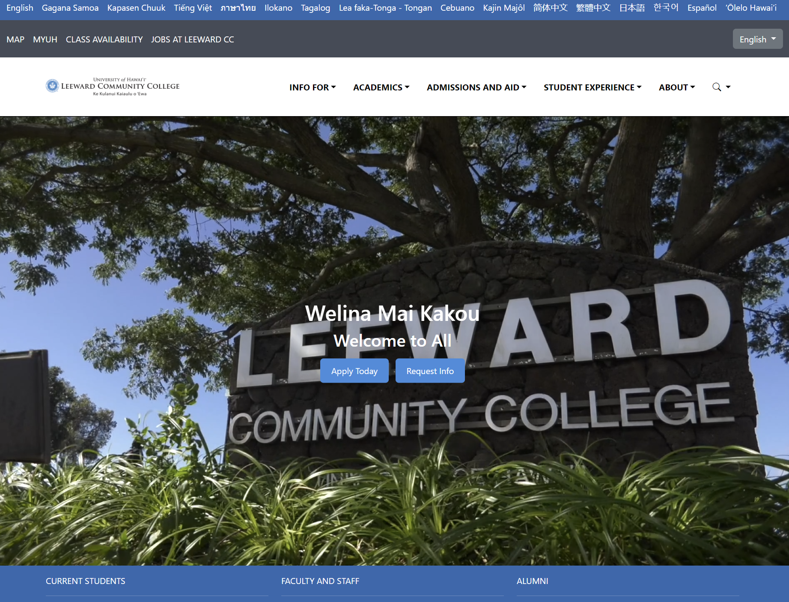

## Introduction
&emsp;The creation of the transistor, which allowed the miniaturization of computers, took less time than mankind discovering the capability to destroy itself . Though it can be frustrating to keep up with the newest and latest fads, technology is developing at a rapid pace. As the Bull Moose, Teddy Roosevelt, said himself, “Nothing in the world is worth having or worth doing unless it means effort, pain, difficulty.” While we Computer Science majors don’t have the luxury of creating a world-ending weapon like the atom bomb, that credit goes to Oppenheimer, at least we can code fun and creative webpages thanks to UI Frameworks.

&emsp;Above is the image of my rushed attempt at recreating the website of Leeward Community College, where I’ve recently completed my associate's degree. Despite the very notable differences such as the size of buttons, positioning of the dropdown buttons, and the padding on the menus, it looks passable enough. Of course, I couldn’t have achieved this replication with HTML and CSS alone. Bootstrap 5 was the UI Framework used to make this cardboard cutout of a webpage possible.

## My experience with Bootstrap 5
&emsp;When creating this webpage, I didn’t have to create as many classes in a CSS file as I did in previous assignments, and there were fewer lines in my HTML file. Thanks to BS5, I was able to call on built-in classes to help me create my menus, add icons, and position text. It didn’t replace the use of the CSS file, so I could still create and enforce changes as I saw fit. The experience was akin to using a screwdriver and a power drill. Bootstrap 5 helped me get the job done the way I wanted to but faster, and it is no doubt why many UX designers have probably integrated BS5 into their toolset.
