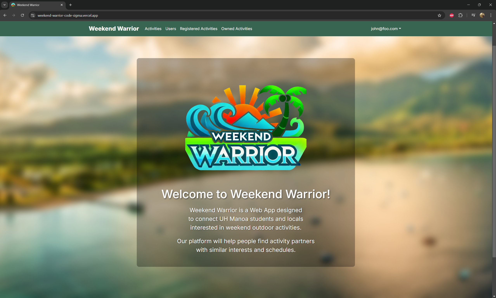
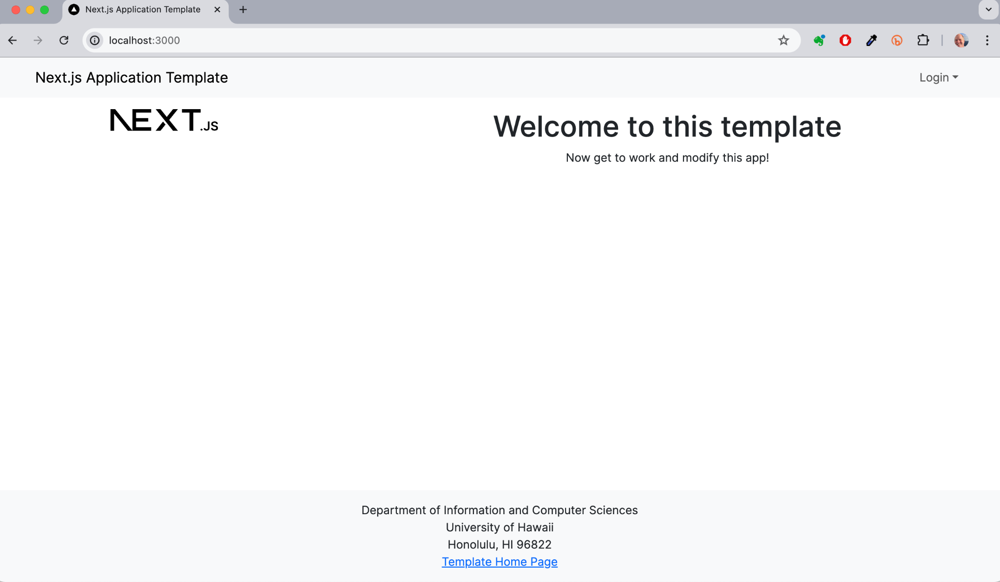

  

## Introduction
Initially, I had believed that Computer Science was primarily focused on programming. As a result of such a misguided belief, I did not fully appreciate the importance of previous ICS courses such as Discrete Mathematics, nor did I dedicate sufficient attention to my mathematics courses up to Calculus II. I had even grown disillusioned with myself over time and didn’t really know why I was pursuing a degree in Computer Science anymore. Consequently, I felt that I had significantly disadvantaged myself and was ill-prepared to take on any challenges I would have to face in this course. 
To be frank, had it not been for professors allowing the use of Artificial Intelligence, I would have been utterly cooked this semester. Prior to this course, I had never used AI and had so little knowledge of it, although I had heard about its capabilities. I was surprised that it was acceptable to use. At some point, it became clear to me that evaluation in this course was not centered on raw programming ability, but rather on fundamental software engineering concepts. As I reflect on this semester, the two concepts I primarily focused on were Development Environments and Agile Project Management. 

## Development Environments
For those unfamiliar with the terminology, a development environment comprises a set of procedures and tools that are used to develop, test, and debug software applications. Integrated Development Environments (IDEs) are central to this process. Prior to this course, my only experience with an IDE was with Jgrasp. In this class, I was introduced to Visual Studio Code (VSCode), which became my primary tool.
Following the course materials, I built upon my experience with programming languages like Java to learn TypeScript. From there, I also learned HTML, the foundational language for web development. Leveraging my newly acquired skills in TypeScript, I progressed to learning React, Bootstrap 5, and finally Next.js. After 10 intense weeks of building a solid foundation in web development, our class moved on to the next phase, where I had to apply my experiences in order to build a functional web application using VSCode, Github, and then deploy it onto a database to store information, ensuring that users could utilize the application properly. 

## Agile Project Management
This was going to be a very demanding endeavor to tackle alone; however, it was essential for me to learn another crucial software engineering concept: Agile Project Management. Teamwork is particularly one of my weakest traits, I’m not so good at working with others but alas, I had to regardless. So I grouped up with the peers at my table. We were a group of four and set off to build our web application, “Weekend Warrior.” In the first week, our team bonded as we knew little about each other and rarely talked prior. We then created our contract where we committed to contributing to the shared goal of completing this assignment. 
Our project was structured around three milestones, a typical approach in Agile Project Management. The first milestone involved the initial creation of our web application, allowing us to outline the basic requirements and establish a working prototype. The second milestone focused on the continued development and refinement of the application. Finally, the third milestone involved significant improvements, ensuring the application was polished and functional. Through this experience, I learned the importance of communication, collaboration, and adaptability in a team setting. Somewhat overcoming my isolationist work approach, I was able to work with my team to meet our goals for our final milestone. 

## Design Patterns
Nearing the end of this semester, I was reaching my limit and neglected to pay attention to the module that covered design patterns, one of the final concepts this course teaches. Design patterns are common solutions to recurring problems in software design, providing a standard approach to solving these issues. This neglect became quite evident in my final project. My group and I focused on implementing features such as account creation, allowing users to create activities, report activities, change their user information, and other functionalities commonly found on social media apps. However I felt that the basic design of our web page looked quite similar to the original nextjs-application-template that we used as a starting point. 

  
  

It was my error that I didn’t step up and encourage us to develop a much more appealing user interface. To be fair, aside from knowing how most websites look, I lack any foundational knowledge of proper design principles. Most likely, I’ll encounter future experiences where I might be expected to come up with a decent design for some form of interface, so I’ll need to focus more on building this concept for myself.

## Conclusion
When I began this course, I was more than a little nervous—fearful, even, just in case my introduction failed to capture that sentiment. Now that I’ve reached the end of this course, weirdly enough, I feel oddly underwhelmed by what I experienced over the last 16 weeks. Maybe it’s because the use of Artificial Intelligence was allowed? I’m not quite sure, as I still had my own challenges and frustrations relying on that tool. Or maybe after an arduous 16 weeks, this feeling is what they call relief. Despite using AI extensively in this course, it was my persistence that carried me through, after all. 
Another takeaway I have from this course is that my future role as someone pursuing a career in Computer Science involves more than just being particularly skilled; I need to be able to work with others, and also be able to explain my thoughts and work processes concisely. This probably also explains why the course had me write several essays throughout the semester. So it’s over and winter break has begun. I'm headed over to Grillby's and to whoever reads this, Auf Wiedersehen.
