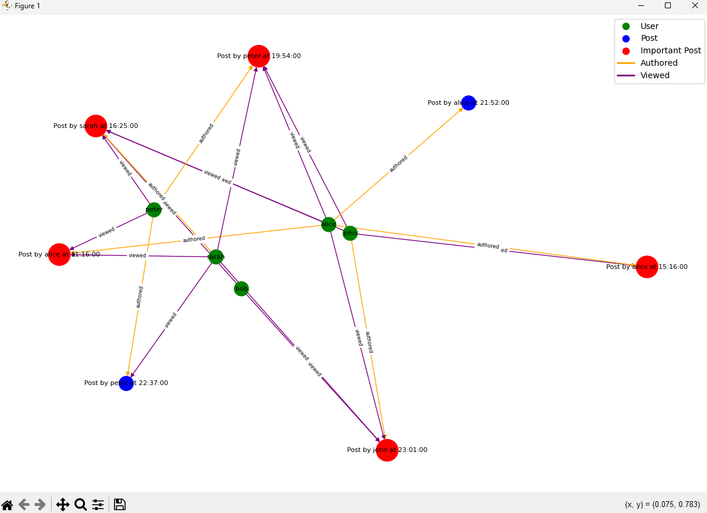

<p align="center">
  
</p>

In this assignment, my group and I were tasked with analyzing social media networks by identifying interesting clusters of content, clusters of users, and directional trends in network usage. Our analysis included creating visual representations such as diagrams of the data and word clouds. We specifically focused on diagramming interesting users, creating a word cloud, and producing a report of trending posts. The diagram highlighted posts and users as nodes, connected by directed edges, and emphasized important posts based on metrics like views and comments. The word cloud visually represented the most frequently used words in posts, allowing for keyword filtering and user attribute-based restrictions. Lastly, the report highlighted trending posts gaining attention at the greatest rate, using efficient data structures for real-time analysis.

While my other two group mates took on the word cloud and the report of trending posts, I worked on creating the diagram for interesting users. With so many posts on social media apps, it can be hard for the average user to keep up to date. We created a diagram that highlights important posts based on views and comments, using Breadth-First Search (BFS) to systematically traverse and process all nodes in the network. BFS is ideal because it ensures that all nodes, representing users and their posts, are processed efficiently.

To highlight important posts, we utilized a priority queue, allowing for efficient insertion and removal of elements based on their importance. These metrics, such as views and comments, serve as keys in the priority queue. Using a max-priority queue ensures that the posts with the highest engagement are always readily accessible. By adjusting the diagram's configuration based on chosen importance criteria, our visual representation provided a clear view of social media interactions, making it easier for analysts to identify and explore key posts and users.

We used Python for this project and used libraries such as networkx and matplotlib. Here's some snippets of the code I worked on:

```python
# intposts_analysis.py
from queue import PriorityQueue

def bfs(G, start_node):
    visited = set()
    queue = [start_node]
    order = []

    while queue:
        node = queue.pop(0)
        if node not in visited:
            visited.add(node)
            order.append(node)
            queue.extend(set(G[node]) - visited)
    
    return order

def find_important_posts(G, importance_criteria='comments', threshold=1):
    pq = PriorityQueue()

    for node, data in G.nodes(data=True):
        if data['type'] == 'post':
            priority = 0
            if importance_criteria == 'comments':
                priority = len(node.get_comments())
            elif importance_criteria == 'views':
                priority = len(node.get_viewers())
            else:
                priority = len(node.get_comments()) + len(node.get_viewers())
            
            if priority >= threshold:
                pq.put((-priority, node.get_time(), node))  # The priority queue uses negative priority for max-heap behavior

    important_posts = []
    while not pq.empty():
        _, _, post = pq.get()
        important_posts.append(post)
    
    return important_posts

# intposts_visualization.py
import networkx as nx
import matplotlib.pyplot as plt

def create_graph(network):
    G = nx.DiGraph()

    for user in network.get_users():
        G.add_node(user.get_username(), label=user.get_username(), type='user')
        for post in user.get_published_posts():
            post_label = f"Post by {user.get_username()} at {post.get_time()}"
            G.add_node(post, label=post_label, type='post')
            G.add_edge(user.get_username(), post, connection='authored')
            for viewer in post.get_viewers():
                G.add_edge(viewer.get_who_viewed().get_username(), post, connection='viewed')

    return G

def draw_graph(G, important_posts):
    pos = nx.spring_layout(G, k=0.3)  # Adjust the k parameter to spread out the nodes more
    node_labels = nx.get_node_attributes(G, 'label')
    
    node_colors = []
    for node in G.nodes():
        if node in important_posts:
            node_colors.append('red')
        elif G.nodes[node]['type'] == 'user':
            node_colors.append('green')
        else:
            node_colors.append('blue')

    node_sizes = [700 if node in important_posts else 300 for node in G.nodes()]
    
    edge_colors = ['orange' if data['connection'] == 'authored' else 'purple' for _, _, data in G.edges(data=True)]
    
    nx.draw(G, pos, labels=node_labels, with_labels=True, node_color=node_colors, node_size=node_sizes, font_size=8, font_color='black', edge_color=edge_colors)
    
    edge_labels = nx.get_edge_attributes(G, 'connection')
    nx.draw_networkx_edge_labels(G, pos, edge_labels=edge_labels, font_size=6)

    handles = [plt.Line2D([0], [0], marker='o', color='w', label='User', markersize=10, markerfacecolor='green'),
               plt.Line2D([0], [0], marker='o', color='w', label='Post', markersize=10, markerfacecolor='blue'),
               plt.Line2D([0], [0], marker='o', color='w', label='Important Post', markersize=10, markerfacecolor='red'),
               plt.Line2D([0], [0], color='orange', lw=2, label='Authored'),
               plt.Line2D([0], [0], color='purple', lw=2, label='Viewed')]

    plt.legend(handles=handles, loc='best')
    plt.show()
