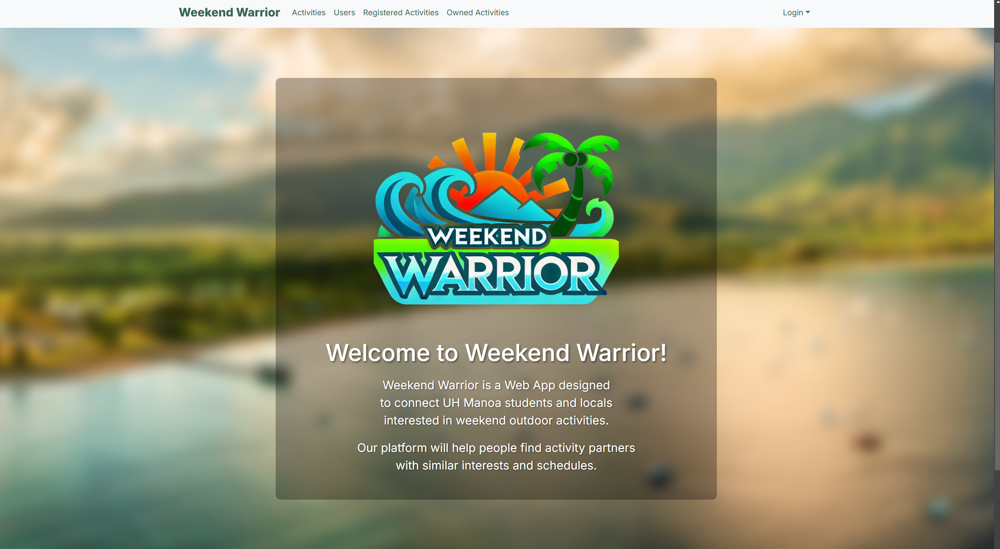
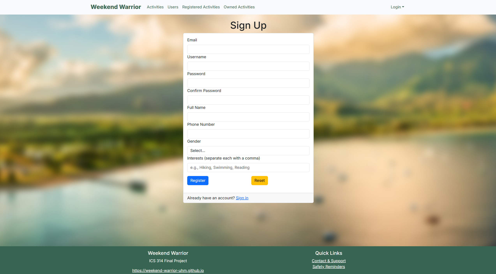
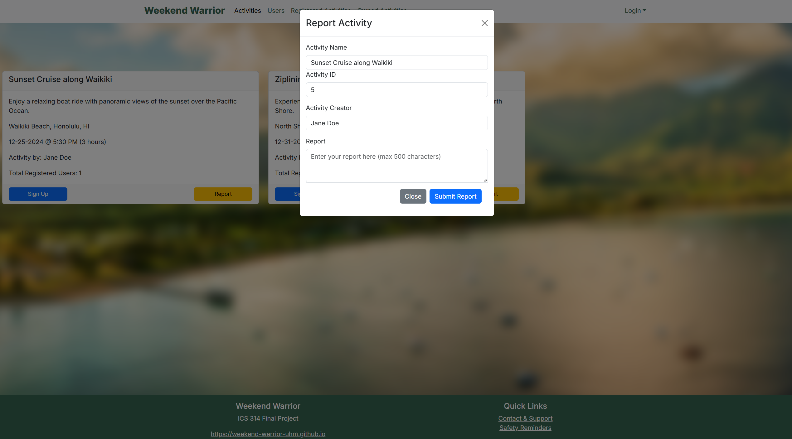

In the final 6 weeks of the ICS 314 Software Engineering course, we were given the task to group with fellow classmates and create a working web application to display the various SE concepts we've learned over the semester. We named our group System32 and the members were me, Nigel Arias, Min Jun Han, and Sean Hiroki Flynn. Together we set out to work on our project idea, "Weekend Warrrior".

## Overview
Many UH Manoa students and locals have a hard time finding people with similar interests to join them in outdoor activities and hobbies. Whether it’s hiking, beach outings, surfing, or just hanging out, it’s not always easy to find partners or groups that align with specific plans or schedules.

Weekend Warrior is a platform that allows users to post their upcoming weekend plans or desired activities and connect with others interested in joining them. This app would serve as a local meetup spot for casual and activity-based connections. It will also make it easier to find activity buddies and plan for fun weekends.

## Features
This application focuses on two main account types, the user(s) and the admin. For the users we implemented these features:
- Account Creation
- Edit Account information
- Create/Delete/Report/Edit Activities
- Join/Unjoin Activities
For the administrator account type, we focused mainly on these features:
- Overview of all acoounts and activities
- Review reports from users
Unfortunately those were the only main features that we were able to implement. Lackluster, I know, there could have been so much more we could've done but at the rate we were working it was unlikely. The primary goal was to allow users a web page they could post their activities and so others could join, and I think that we accomplished that goal. Essentially what our application was turning out to be was a social media platform, had we begun to implement more features such as posting pictures, messaging, etc. but our goal wasn't to go that far as we really just wanted to get our feet wet. 

Here are some images:

  
  
  

## Contributions
On this project, I created the landing page, "Activities" page, the "Contact & Support" w/ Safety Reminders on the footer, gave users the ability to create their activities and post them, and built off of the existing account creation feature from the nextjs-application-template. This was a great experience to have, as while I think I was able to carry my weight in the team by getting us started on some of our features, it came with issues that I wasn't able to figure out on my own or that I wasn't able to due to my focus being towards other assignments. What a way to end this course.
